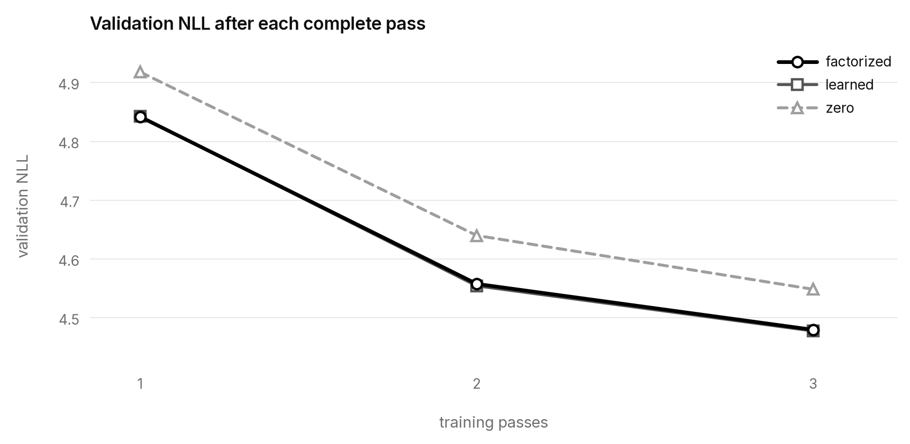

# Product-Key Initialization for Sparse Delta Memory

## Intuition

Sparse Delta Memory can begin each sequence from zero, or from a learned value
at every memory slot. The learned option is useful: the
[SDM paper](https://arxiv.org/html/2607.07386#S6) reports that it improves code
NLL from 0.845 to 0.822 and RULER from 28.0 to 31.2. But it assigns an
independent dᵥ-vector to every slot. For N slots, the initial memory alone
therefore grows as Θ(Ndᵥ) learned parameters.

Product-key factorization gives a third option. SDM already locates a slot by
combining two product-key indices. The same pair can compose its initial value:

```text
M₀[i, j] = A[i] + B[j]
```

A and B each contain √N value vectors. Every factor row is reused by all
addresses sharing one routing component, reducing learned initial-memory
parameters to Θ(√N dᵥ). The recurrent memory itself remains the full N × dᵥ
table; only its starting values are factorized.

## Construction

The experiment parametrizes the released SDM layer's existing
`mixer.memory` tensor. The SDM layer, product-key routing, recurrence,
controller, forward path, and CUDA kernels are unchanged.

Three matched arms differ only in M₀:

- **Zero:** every slot begins at zero.
- **Factorized:** two learned factor tables add to form each slot's value.
- **Learned:** every slot has an independent learned value.

All other parameters begin bit-identically. The factorized and learned arms use
the same semantic initialization seed and target materialized variance.

The experiment uses an eight-layer model with seven SDM blocks and one
attention block, totaling about 15M trainable parameters. The seed-0 run makes
three passes over 117,980,449 scored WikiText-103 training targets, for
353,941,347 target presentations per arm.

## Result

| Initial memory | Learned M₀ parameters | Validation NLL | Test NLL |
|---|---:|---:|---:|
| Zero | 0 | 4.54865 | 4.54855 |
| Factorized | 57,344 | 4.47978 | 4.48327 |
| Learned | 917,504 | 4.47779 | 4.48311 |



At this tested size and seed, the factorized initial memory roughly matched the
full learned table throughout training. The zero-initialized arm had higher
NLL, qualitatively agreeing with the direction reported in the SDM paper.

## Why it matters

SDM's learned initial memory is one of its remaining dense scaling terms: it
stores a dᵥ-vector for every logical slot, so its parameters grow as Θ(Ndᵥ).
Zero initialization removes that term, but worsens loss.

Factorizing M₀ across the router's two indices reduces the learned term to
Θ(√N dᵥ). In this experiment, it retained roughly the same loss as a fully
learned initial memory while replacing linear-in-N parameter growth with
square-root growth.

## Reproduction

The repository reruns the three recorded seed-0 arms from a clean checkout:

```bash
uv sync --frozen
uv run --no-sync ./reproduce.sh all
```

See [REPRODUCING.md](REPRODUCING.md) for the data identity, accelerator
requirements, runtime, cost, expected metric range, and output paths. Exact
definitions and settings are in [APPENDIX.md](APPENDIX.md);
[data/results.json](data/results.json) and [provenance.json](provenance.json)
contain the compact measurements and provenance.

## References

- Loïc Cabannes et al., [Sparse Delta Memory: Scaling the State of Linear RNNs through Sparsity](https://arxiv.org/abs/2607.07386), 2026.
- Guillaume Lample et al., [Large Memory Layers with Product Keys](https://arxiv.org/abs/1907.05242), 2019.
- Stephen Merity et al., [Pointer Sentinel Mixture Models](https://arxiv.org/abs/1609.07843), 2016.
